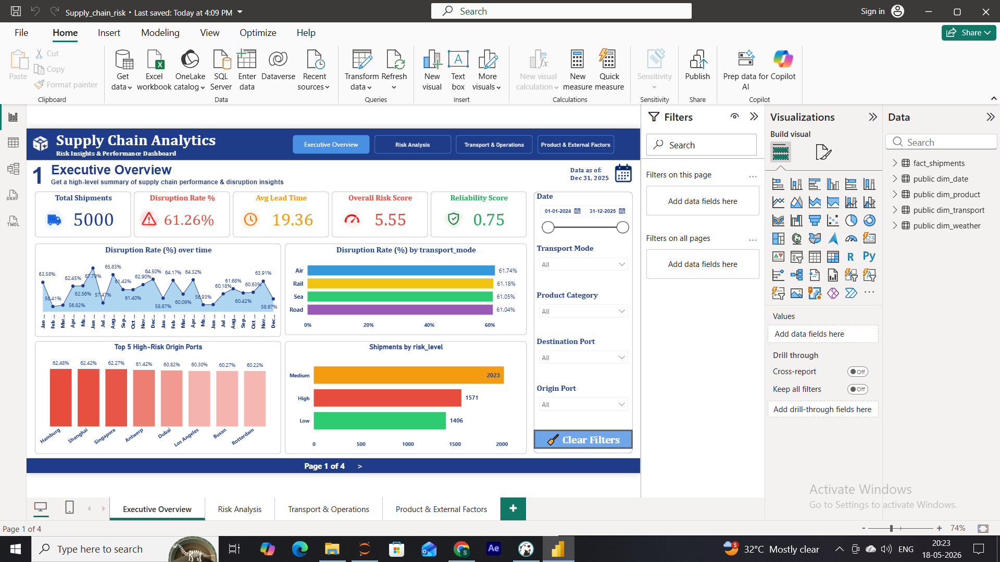
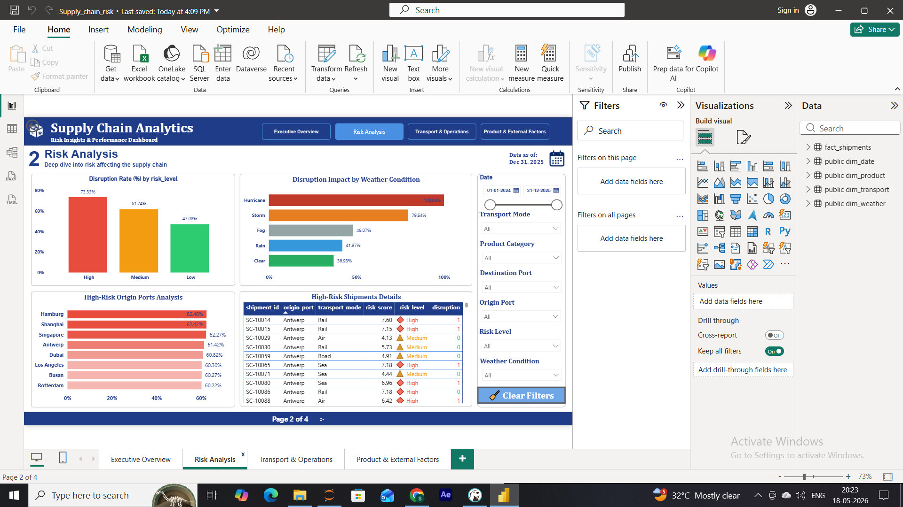
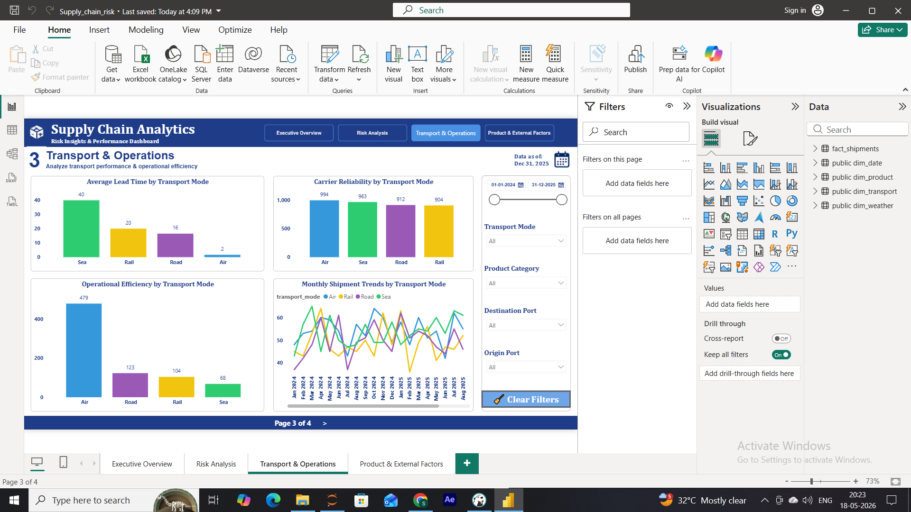
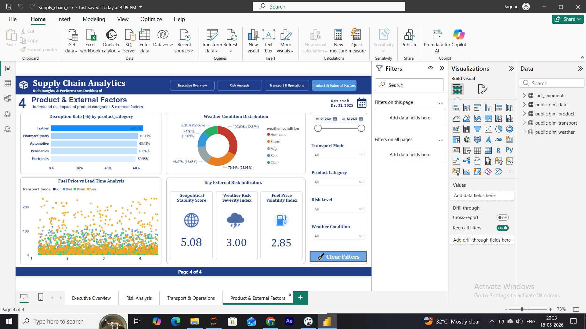
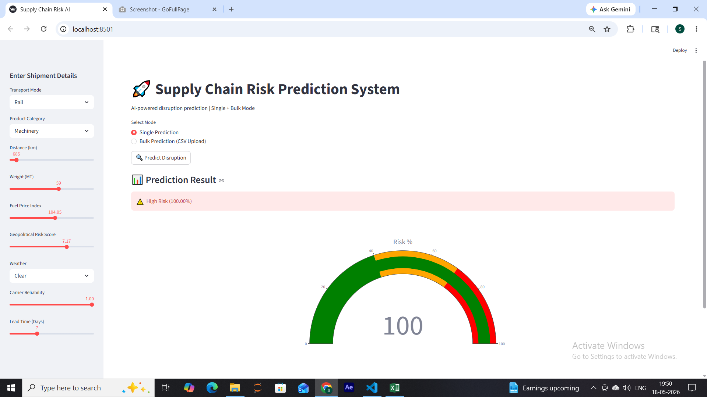
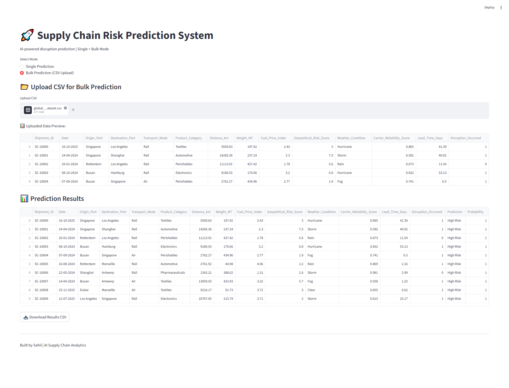

# 🚀 AI-Driven Supply Chain Risk & Logistics Optimization System (2024–2026)

---

## 📌 Project Overview
An end-to-end **Supply Chain Analytics & Risk Prediction System** built using **SQL, Python, and Power BI**.

This project analyzes 5000+ shipments to:
- Identify disruption risks
- Optimize logistics decisions
- Predict shipment failures using Machine Learning

---

## 🧱 Tech Stack
- **SQL:** PostgreSQL (Star Schema)
- **Python:** Pandas, NumPy, Scikit-learn, XGBoost
- **Visualization:** Power BI
- **App:** Streamlit

---

## 🗄️ Data Architecture
- Fact Table: `fact_shipments`
- Dimension Tables:
  - `dim_date`
  - `dim_transport`
  - `dim_product`
  - `dim_weather`

✔️ Optimized using **Star Schema Design**

---

## 📊 Key Business Insights

### 🚨 Critical KPI
- **Disruption Rate:** 61.26%
- **Avg Delivery Time:** 19.36 days

---

### 🚚 Transport Performance
- Air → Fastest but highest disruption  
- Sea → Most stable (lowest risk)  
- Rail → Best balance  

---

### 🌦️ Weather Impact
- Hurricane → **100% disruption**
- Storm → ~80%
- Clear → Lowest risk  

---

### ⏱️ Delivery Speed Impact
- Slow deliveries → **70% disruption**
- Fast deliveries → **53% disruption**

---

### 📦 Product Risk
- Textiles → Highest disruption  
- Electronics → Most efficient  

---

## 🤖 Machine Learning Model

### Models Used:
- Logistic Regression ✅ (Best)
- Random Forest
- XGBoost

### Performance:
- **F1 Score:** ~0.78
- Balanced precision & recall

---

## 📊 Power BI Dashboard

### Features:
- KPI Cards
- Transport Analysis
- Weather Impact
- Monthly Trends
- Risk Heatmaps

📸 Screenshots:

---

## 🌐 Streamlit Application

Features:
- Single Prediction
- Bulk CSV Prediction
- Risk Probability Output
- Downloadable Reports

📸 Screenshots:

---

## 📁 Project Structure

supply-chain-risk-analytics-ml-system/
│
├── app/                         # Streamlit application
│   └── app.py
│
├── data/                        # Raw & processed datasets
│   ├── raw/
│   └── processed/
│
├── images/                      # Screenshots (Dashboard, App, Results)
│   ├── powerbi_dashboard.png
│   └── streamlit_app.png
│
├── models/                      # Saved ML models
│   ├── model.pkl
│   └── scaler.pkl
│
├── notebooks/                   # Jupyter notebooks (EDA, training)
│   ├── eda.ipynb
│   └── model_training.ipynb
│
├── outputs/                     # Predictions & generated outputs
│   └── predictions.csv
│
├── powerbi/                     # Power BI dashboard file
│   └── dashboard.pbix
│
├── reports/                     # Documentation & reports
│   ├── final_report.md
│   ├── sql_analysis.md
│   ├── ml_insights.md
│   ├── eda_insights.md
│   └── dashboard_explaination.md
│
├── sql/                         # PostgreSQL scripts
│   ├── schema.sql
│   └── queries.sql
│
├── requirements.txt             # Python dependencies
└── README.md                    # Main project documentation

---

## 💡 Business Recommendations
- Avoid high-risk routes during extreme weather
- Use high-reliability carriers
- Optimize slow delivery pipelines
- Implement real-time risk monitoring

---

## 🚀 Future Improvements
- Real-time data pipeline
- ML deployment (API)
- AI-based routing system

---

## 📢 Conclusion
This project demonstrates a **complete data analytics pipeline**:
➡️ Data Engineering → SQL Analytics → ML Modeling → Dashboard → Deployment

---

## ⭐ If you like this project, give it a star!
